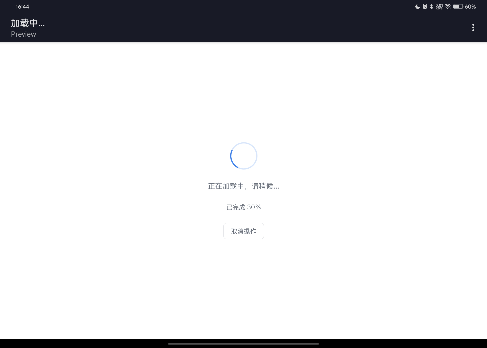

# Tamd Status Pages - 简约优雅的状态页面模板库

## 🎯 项目简介

Tamd Status Pages 是一套精心设计的网站状态页面模板集合，包含了开发中常见的各种状态场景。无论是错误提示、加载效果还是空白状态，都能让你的网站保持专业统一的视觉风格。

## ✨ 核心特色

- **极简设计**：纯白底色搭配精心挑选的配色，干净清爽不花哨
- **精细动画**：恰到好处的微交互，提升用户体验但不喧宾夺主
- **开箱即用**：直接复制HTML文件就能使用，零依赖
- **完全响应**：完美适配手机、平板和电脑各种屏幕
- **完整场景**：覆盖了开发中90%需要状态提示的场景

## 📦 包含模板

### 🚨 错误提示类
- 404 页面不存在
- 403 权限不足
- 500 服务器错误  
- 通用错误页面

### 🛠️ 系统状态类
- 维护模式页面
- 加载中效果
- 退出登录确认页

### 📊 数据状态类  
- 空白数据提示
- 搜索无结果
- 操作成功提示

## 🚀 快速上手

1. 克隆仓库：
   国外
```bash
git clone https://github.com/alonehill/tamd-status-pages.git
```
   国内
```bash
git clone https://gitee.com/alonehill/tamd-status-pages.git
```

2. 将需要的HTML文件复制到你的项目

3. 简单三步集成：
```html
<!-- 在需要的地方跳转到状态页 -->
<a href="/404.html">查看404页面</a>
```

## 🎨 自定义指南

修改`styles.css`中的CSS变量即可调整整体风格：
```css
:root {
  --primary: #3b82f6;  /* 主色调 */
  --error: #ef4444;    /* 错误色 */
  --success: #10b981;  /* 成功色 */
  --radius: 8px;       /* 圆角大小 */
  --space: 24px;       /* 间距大小 */
}
```

## 🌍 图片预览

| 页面类型 | 效果图 |
|---------|--------|
| 访问受限 |  |
| 404页面 |  |
| 服务器错误 |  |
| 空页面 |  |
| 错误页面 |  |
| 加载页面 |  |
| 退出登录 |  |
| 维护页面 |  |
| 无搜索内容 |  |
| 成功页面 |  |

## 🤝 参与贡献

欢迎提交PR或Issue！特别需要：
- 更多语言版本
- 更丰富的动画效果
- 其他状态场景模板

## 📜 开源协议

MIT License - 完全免费，商用也没问题

## 💖 谁在用这个项目

暂无

> 你的公司也在用？欢迎提交PR添加到这个列表！

## 📞 联系我们

有问题或建议？欢迎：
- 提交GitHub Issue
- 发送邮件至：3150675236@qq.com
- 加入我们的群组：暂无，有需求创建

---

让网站的所有状态提示都保持专业优雅，就从Tamd Status Pages开始吧
