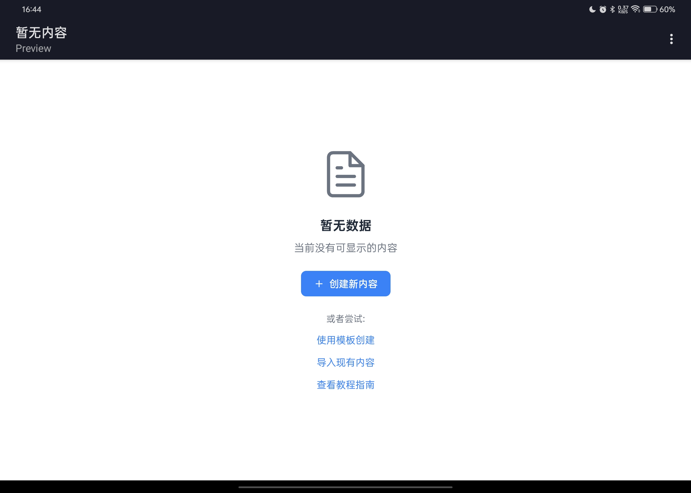
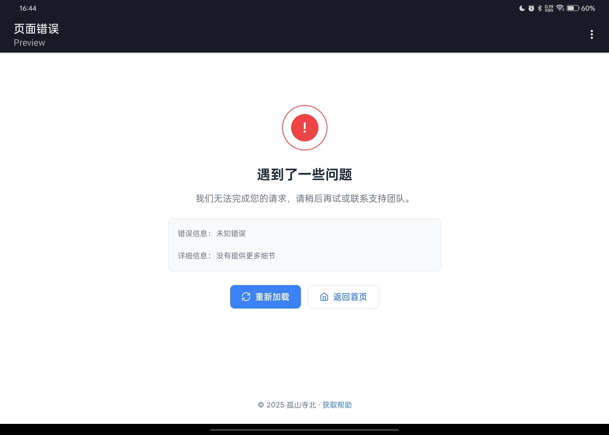
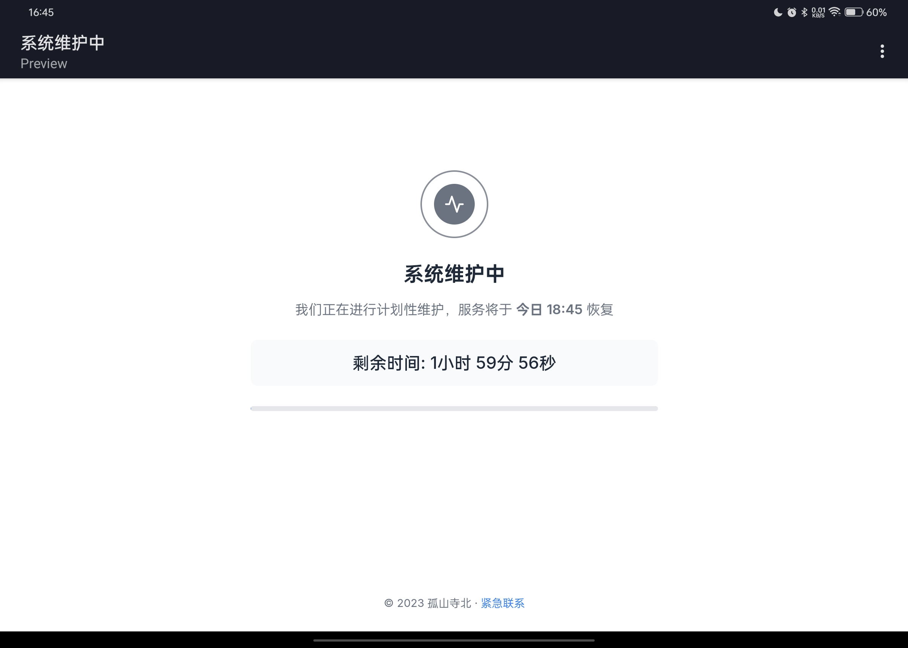
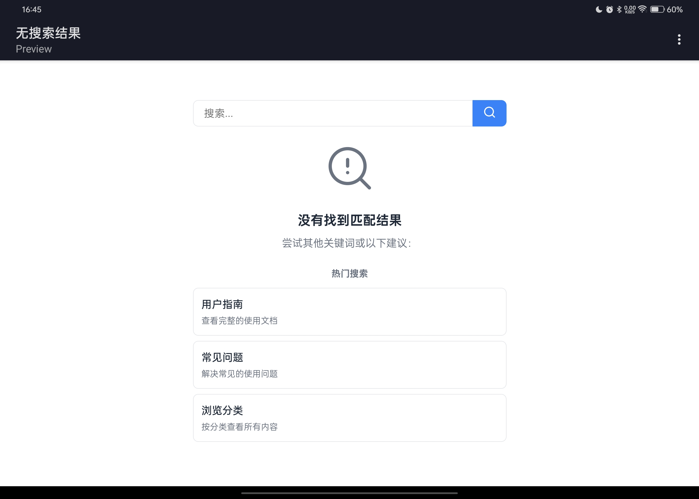

# Tamd Status Pages — Minimal & Elegant Status Page Templates  

## 🎯 Project Overview  
**Status Pages** is a curated collection of beautifully designed website status templates, covering common scenarios like errors, loading states, and empty data displays. Keep your site's UX consistent and professional with these ready-to-use templates.  

## ✨ Key Features  
- **Minimalist Design**: Clean white base with carefully selected accent colors  
- **Subtle Animations**: Delicate micro-interactions enhance UX without distraction  
- **Zero Dependencies**: Pure HTML/CSS — just copy and deploy  
- **Fully Responsive**: Flawless on mobile, tablet, and desktop  
- **Comprehensive Coverage**: 90% of common status scenarios included  

## 📦 Included Templates  

### 🚨 Error States  
- 404 Not Found  
- 403 Forbidden  
- 500 Server Error  
- Generic Error  

### 🛠️ System Status  
- Maintenance Mode  
- Loading Indicators  
- Logout Confirmation  

### 📊 Data States  
- Empty Data Placeholder  
- No Search Results  
- Success Confirmation  

## 🚀 Quick Start  
1. Clone the repo:  
```bash  
git clone https://github.com/alonehill/tamd-status-page.git  
```  

2. Copy desired HTML files to your project  

3. Simple integration:  
```html  
<!-- Link to status pages as needed -->  
<a href="/404.html">View 404 Page</a>  
```  

## 🎨 Customization Guide  
Modify these CSS variables in `styles.css` to match your brand:  
```css  
:root {  
  --primary: #3b82f6;  /* Brand color */  
  --error: #ef4444;    /* Error state */  
  --success: #10b981;  /* Success state */  
  --radius: 8px;       /* Border radius */  
  --space: 24px;       /* Default padding */  
}  
```  

## 🌍 Preview Gallery  

| Page Type       | Preview |  
|-----------------|---------|  
| Access Denied   |  |  
| 404 Not Found   |  |  
| Server Error    |  |  
| Empty State     |  |  
| Generic Error   |  |  
| Loading         |  |  
| Logout          |  |  
| Maintenance     |  |  
| No Results      |  |  
| Success         |  |  

## 🤝 Contributing  
PRs and issues welcome! Priority needs:  
- Additional language versions  
- More animation variants  
- New status scenarios  

## 📜 License  
MIT Licensed — Free for commercial use  

## 💖 Used By  
*None yet*  

> Using this in your project? Submit a PR to be featured here!  

## 📞 Contact  
Have questions or suggestions?  
- Open a GitHub Issue  
- Email: 3150675236@qq.com  
- Community: *Coming soon*  

---  
**Elevate your website's status messages with elegant simplicity.**  
